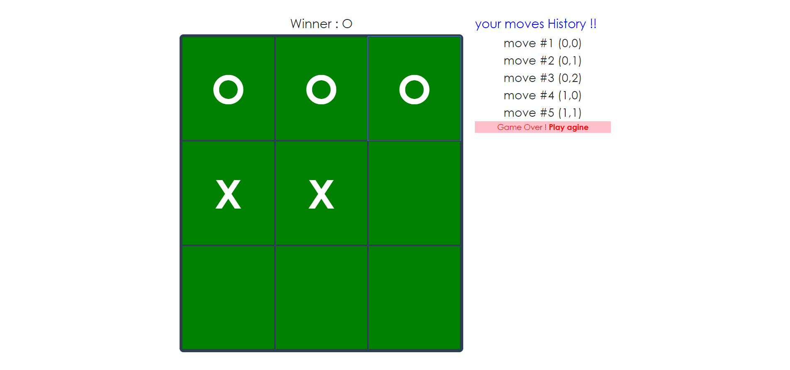

# tic-tac-toe-starter





> A quick walkthrough of my tic-tac-toe-starter app built using React, sass


## See it live

[tic-tac-toe-starter live on github](http://Ghassanooooo.github.io/tic-tac-toe-starter)

## Quick Start

```bash
# Install dependencies for server
npm install


# Run the client 
npm start


# client run on http://localhost:3000
```


## App Info

### Author

Ghassan Aldarwish
[al-developer](https://al-developer.herokuapp.com/)

### Version

1.0.0

### License

This project is licensed under the MIT License
